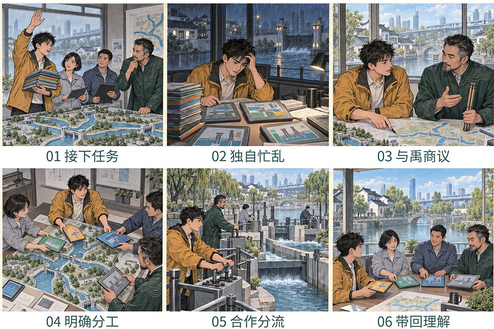

# 梦蝶记 Mengdie Ji

**把你最近的一段经历，和一则中国古典故事放在一起读，再把你们共同写成的新支线演出来。**

[架构与不变量](docs/architecture.md) · [数据与配置](docs/data-and-config.md)



“梦蝶记”取意庄周梦蝶，界面借传统蝴蝶装的对页：一页是古籍里的故事，一页是你的经历，两页相对，互相映照，但不混写。

一次体验分三步：

1. **相遇**：从最近的一件小事说起。故事向导「栖蝶」倾听、追问，整理出一份你确认过的经历摘要；再从 12,383 则古典故事中，为你找出可以对照的篇章，并写明推荐理由和出处。
2. **共谱**：选一则故事，栖蝶依据原文，用“英雄之旅”的五个节点起草一份映照：左边是原典情节，右边是对应的你的经历。你可以在画布上直接改，也可以和栖蝶对话改。
3. **再演**：你认可的映照被编成 4–7 幕纸影剧场，逐幕配中式绘本、语音旁白和环境音。

原典始终只读，你写下的内容进入单独标注的 `user_branch`。AI 起草，由你定稿。

> 这是研究型 Demo，不是疗愈或临床产品，也没有证据表明它有疗愈效果。

## 设计取舍

- **原典与个人经历分层**：`source_canon` 只读，任何新写内容都进入明确标注的用户分支，不会改写古籍。
- **推荐有据可查**：检索 → 重排 → 逐卡理由的链路里，模型只看到服务端召回的候选（最多 8 条、每条 ≤500 字），推荐卡必须带古籍与卷次出处。
- **模型失败不中断体验**：每一步都有经过测试的确定性回退——检索词、五节点初稿、逐幕画面都是如此，不会把用户卡在错误状态。
- **云端调用要明确同意**：入口只有一个打包确认框，勾选后，摘要、候选摘录、映照请求和逐幕画面才会发往云端。录音可选，只存在页面内存，不上传。

## 语料

来自 6 部中文维基文库开放古籍——《太平广记》《夷坚志》《阅微草堂笔记》《子不语》《续子不语》《聊斋志异》——切分、去重后的 12,353 则来源故事，加 30 则编辑精选故事（盘古开天、大禹治水、嫦娥奔月、白蛇传、南柯一梦等），共 12,383 个可选候选。

**请注意**：这 12,353 则是自动切分的，没有逐条做异文、敏感内容与文化复核，不能称作“12,353 个专家标注神话”；全部标记为 `production_eligible=false`，仅为本地 Demo 口径。30 则精选故事里，3 则含敏感内容，须用户显式同意才会出现。来源、许可与审计缺口见 [data/sources/README.md](data/sources/README.md) 与 [rights_gap_register](data/audits/rights_gap_register.md)。

## 本地运行

需要 Node.js 20+、Python 3.10+。

```powershell
npm.cmd install
python -m pip install -r api/requirements.txt
Copy-Item .env.example .env
npm.cmd run dev
```

- Web <http://127.0.0.1:3001> · API <http://127.0.0.1:8010> · OpenAPI <http://127.0.0.1:8010/docs>
- **不填密钥也能跑完整流程**：此时走确定性回退。
- 要启用真实模型：在 `.env` 设置 `DEEPSEEK_API_KEY` 和 `ENABLE_LIVE_MODEL_GENERATION=true`；逐幕图片另需 `DASHSCOPE_API_KEY`、`ALIYUN_IMAGE_API_HOST` 和 `ENABLE_IMAGE_GENERATION=true`。
- 密钥只放服务端 `.env`，不要放进 `VITE_*` 变量，否则会被打进浏览器包。

测试：`npm.cmd run test`（类型检查 + 前端 + API）。通过只说明代码与不变量检查没问题，不等于文化复核、部署验收或用户测试。

## 技术栈

React + Vite（前端）· FastAPI（会话状态机、安全、来源与模型网关）· SQLite FTS5/BM25（召回）· DeepSeek（摘要整理、检索规划、重排与理由、映照与剧本）· 阿里云图像生成（逐幕绘本）· 浏览器语音合成与 Web Audio（旁白与环境音）

```text
src/          相遇 / 共谱 / 再演 三阶段前端
api/app/      会话、状态机、安全、检索与模型网关
api/tests/    不变量与黄金路径测试
data/         语料 C0–C3、主文本选择、审核缺口
contracts/    数据与模型输出 Schema
docs/         架构、开发状态、待决事项
```

## 尚未完成

- 语料的文化复核、近重复与敏感内容逐条审计。
- 面向真实用户的形成性测试与浏览器视觉验收。
- 照片输入、强制录音、人格匹配、治疗性主张均不在一期范围内。

更多见[开发状态](docs/implementation-status.md)与[待确认事项](docs/pending-decisions.md)。

## 理论参考

Rogers 等（2023）的英雄之旅脚手架 · White & Epston（1990）的叙事再著 · Uriu 等（2021）的数字仪式。

