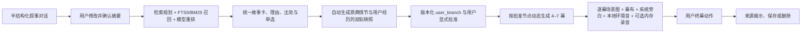
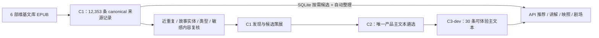

# 架构与不变量

## 纵向切片

## 必须保持的不变量

1. 本地技术 Demo 的推荐候选由 C3 深标故事与 C1 canonical 单篇共同组成；C1 由 SQLite 按需取用并显式显示“自动整理”，不因未逐条审计而阻断。C1-secondary 与 metadata-only 研究线索仍不进入推荐。
2. C3 中每个故事 ID 恰好对应一份产品主文本；同一故事出现两条运行记录时语料库必须 fail-closed，不能任意挑第一条。
3. 一次选择只有一则故事，内部 `story_version_id` 只用于追踪其唯一主文本，不存在异文选择或 `combine`。
4. `source_canon` 创建后按规范化 JSON 计算哈希；用户或模型输出不能改变该哈希，也不能从后台第二见证偷渡情节。
5. 每次节点提交创建新 `user_branch_version`，并保留父版本。
6. 只有用户批准的分支版本可以编译剧场。
7. 每段最终文本都标记 `source_supported`、`interpretive_bridge` 或 `user_created`，并标记 `source`、`user` 或 `model` 表达主体。
8. 安全路由先于检索和生成；被阻断的私人文本不进入故事、剧场、模型请求或派生缓存。
9. 删除会话后，所有会话专属支线、剧本、动作和缓存不可再取回；共享语料不受影响。
10. 语言模型、图片、旁白和音频都是可失败的增强服务；失败不破坏完整的本地回退路径。
11. 未取得 `cloudProcessingAccepted=true` 时，外部模型适配器不得被调用；浏览器旁白、Web Audio 与 MediaRecorder 分别由用户显式触发。
12. C1 来源层的“唯一”只表示规范化精确文本哈希唯一；近重复聚类、故事实体裁决、人工标注和文化复核完成前，不能把记录数当作独立故事数。

## 语料分层

当前 C1 来源快照有 12,354 条接受行，其中 1 条为规范化精确重复，形成 12,353 条 canonical/full-text 记录。按技术 Demo 决策，这 12,353 条全部 `runtime_eligible=true` 并进入轻量推荐池；选中后由确定性兜底生成讲解、mapping 与剧场输入。30 条 C3 主文本继续提供编辑深标体验。全部 C1 仍 `production_eligible=false`，近重复与敏感内容状态不会被伪装成已审计。

## 来源与支线的界面语义

- 原典线：矿物绿，表示可追溯但不可改写的 `source_canon`。
- 支线：灯火金，表示由用户批准、可以继续修订的 `user_branch`。
- 印章红：只表示确认、警示或来源揭示，不表示“AI 判断正确”。
